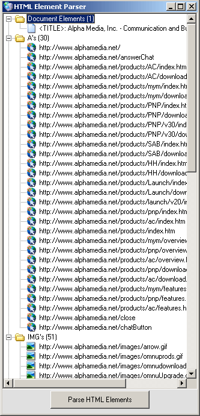



## Using MSHTML and VB \- NO MORE HTML PARSING\!\!\!

### Description

This code will create a new instance of internet explorer (although it will not be set to visible.) then it will goto the URL of you choice, and once the web page has finished loading it will get a list of a wide variety of HTML elements and place them in the Treeview. As you can see this is much easier than parsing each of these links all by yourself, and probably faster too.

Please note that the loop waiting for the web page to load is very sloppy, but was just added to demonstrate this functionality. Normally there should be code in the DocumentComplete Event of the InternetExplorer object to handle this functionality. Also, this code can be VERY easily changed to include functionality for ALL HTML tags.
 
### More Info
 

             |
---                |---
**Submitted On**   |2004-03-30 16:37:56
**By**             |[\[\]\)utch\[\]v\[\]aster](https://github.com/Planet-Source-Code/PSCIndex/blob/master/ByAuthor/utch-v-aster.md)
**Level**          |Intermediate
**User Rating**    |5.0 (40 globes from 8 users)
**Compatibility**  |VB 5\.0, VB 6\.0
**Category**       |[Internet/ HTML](https://github.com/Planet-Source-Code/PSCIndex/blob/master/ByCategory/internet-html__1-34.md)
**World**          |[Visual Basic](https://github.com/Planet-Source-Code/PSCIndex/blob/master/ByWorld/visual-basic.md)
**Archive File**   |[Using\_MSHT1726533302004\.zip](https://github.com/Planet-Source-Code/utch-v-aster-using-mshtml-and-vb-no-more-html-parsing__1-52755/archive/master.zip)

